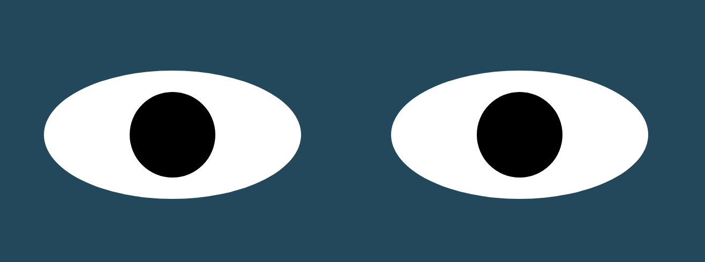
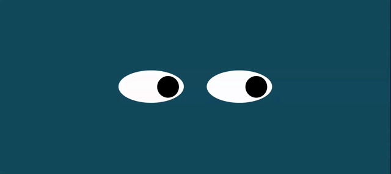

# eye-movement
It's a fun project which has a pair of eyes with eyeballs that move in accordance to the mouse movement.

**What I Learned**
- Capturing the movements of the mouse through its coordinates and mapping it in a focussed region to move an object(eyeball) using 'onmousemove' 

**eyes**

## Description

- The eyeballs in each of the eye follows the movement of the mouse. Its being accomplished by onmousemove where the mouse coordinates are captured and mapped to the inner eye region so that the eyeball moves in accordance with the mouse.

## Installation

- Download this project in your working directory through, \
git clone https://github.com/vanisbala/eye-movement
- Open eye-movement project in VScode, go to index.html, right click and select 'open in default browser'.
- The project output will open in your browser.
- Move the mouse anywhere on the screen.
- Observe the movement of the eyeballs.
- It will just move in accordance with the mouse movements.
### 

## Built with

- [HTML](https://developer.mozilla.org/en-US/docs/Web/HTML)
- [CSS](https://developer.mozilla.org/en-US/docs/Web/CSS)
- [JavaScript](https://developer.mozilla.org/en-US/docs/Web/Javascript)

## Deployed Link

- [See live Site](https://vanisbala.github.io/eye-movement/)

## Roadmap

- Closing the eyes when the mouse moves and touches the bottom edge of the window. Then, open the eyes once the mouse moves away from the bottom edge.

## Support

-  [Link to Github](https://github.com/vanisbala)

## License

- [MIT License](https://github.com/vanisbala/eye-movement/blob/profilepro/LICENSE)

## Credits

Thanks to MITxPRO for giving me the opportunity to work on this project. 

The wonderful MIT professors who always gives simple easy understand explanations for any complex topic,
- Abel Sanchez
- John Williams  

My gratitudes to our learning facilitators, for their guidance throughout the project
- Carolina Barreiro
- Greg Lindeman
- Puneet Saraswat

